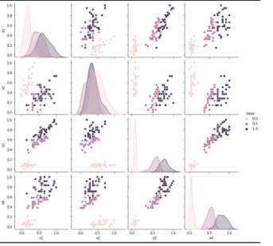
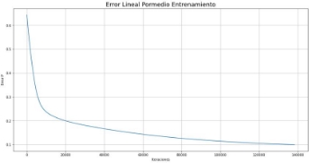

# Clasificación de datos “IRIS” mediante RNA

Abstract—The selection of parameters and designing neural networks problem is of great importance when designing classification algorithm. This paper presents presents a graphic way of how to select the ideal parameters, with them to make an approach to the development of machine learning algorithms, specifically the algorithm of monolayer and multilayer neural networks to perform the classification of plants.

Index Terms—clasification, neural network, machine learning, data set, Bias.

1. INTRODUCCIÓN

A. Redes Neuronales

El cerebro humano es una fuente de inteligencia natural y una computadora paralela verdaderamente notable. El cerebro procesa informacion´ incompleta obtenida por percepción a un ritmo increíblemente rapido.´ Las celulas´ nerviosas funcionan unas 106 veces mas´ lentamente que las puertas de los circuitos electronicos,´ pero el cerebro humano procesa la informacion´ visual y auditiva mucho mas´ rapido´ que las computadoras modernas, Inspirandose´ en el cerebro se han estado explorando las redes neuronales artificiales, se modela el cerebro como un sistema dinamico´ no lineal de tiempo continuo en arquitec- turas conexionistas que se espera que imiten los mecanismos cerebrales para simular un comportamiento inteligente [1].

Las redes neuronales artificiales, o simplemente redes neuronales (NN), Se han propuesto e investigado bastantes modelos NN en los ultimos´ anos.˜ Estos modelos NN se pueden clasificar de acuerdo con varios criterios, como sus metodos´ de aprendizaje (supervisado versus no supervisado), arquitecturas (feedforward vs recurrente), tipos de salida (binario versus continuo), tipos de nodo (uniforme versus h´ıbrido), implementaciones (software versus hardware), pesos de conexion´ (ajustables versus cableados), operaciones (mo- tivadas biologicamente´ versus motivadas psicologicamente),´ etc. En este caso nos limitamos al modelado de problemas con conjuntos de datos de entrada-salida deseados, por lo que las redes resultantes deben tener parametros´ ajustables que se actualicen mediante una regla de aprendizaje supervisado.

1) Adaline (LMS): En una implementacion´ f´ısica simple,

las senales˜ de entrada xi son voltajes y las wi son conduc- tancias de resistencias controlables; la salida de la red es la suma de las corrientes causadas por los voltajes de entrada. El problema es encontrar un conjunto adecuado de conductancias (o pesos) de modo que el comportamiento de entrada-salida del Adaline este´ cerca de un conjunto de puntos de datos de

Fig. 1. Neurona

entrada-salida deseados, la medida de error de un Adaline de salida unica´ se puede expresar como:

Ep = (tp − op)2 (1)

donde tp es la salida de destino y op es la salida real de Adaline. La derivada de Ep con respecto a cada peso wi es:

∂Ex = −2(t (2) ∂wi p − op)xi

Por lo tanto, para disminuir Ep por descenso de gradiente, la formula´ de actualizacion´ para wi en el patron´ de entrada-salida es:

∇pwi = η(tp − op)xi (3)

Se establece que cuando tp > op se quiere impulsar op aumentando wixi, se debe aumentar wi si xi es positivo y disminuir wi si xi es negativo, se usa un razonamiento similar cuando tp < op, dado que el delta trata de minimizar los errores cuadraticos´ o m´ınimos cuadrados promedio (LMS).

2) Perceptron multicapa backpropagation (MLP): Una

backpropagation MLP, es una red adaptativa cuyos nodos (o neuronas) realizan la misma funcion´ en las senales˜ en- trantes; esta funcion´ de nodo suele ser un compuesto de la suma ponderada y una funcion´ de activacion´ no lineal diferenciable, tambien´ conocida como funcion´ de transferencia Generalmente dejamos que la funcion´ de nodo para la capa

Fig. 2. Funciones de activacion´

de salida sea una suma ponderada sin funciones aplastantes. Esto es equivalente a una situacion´ en la que la funcion´ de activacion´ es una funcion´ de identidad y los nodos de salida de este tipo a menudo se denominan nodos lineales. Las MLP

con backpropagation son las estructuras NN mas´ utilizadas para aplicaciones en una amplia gama de areas,´ como el reconocimiento de patrones, el procesamiento de senales,˜ la compresion´ de datos y el control automatico.´

3) Regla de aprendizaje backpropagation: el algoritmo de

backpropagation en cuestion´ utiliza la funcion´ log´ıstica como su funcion´ de activacion´ La entrada neta x de un nodo se define como la suma ponderada de las senales˜ entrantes mas´ un termino´ de bias, para la figura[ 3 ](#_page1_x126.64_y328.70)se tiene:

x¯ = wij xi + wj (4)

i

1

xj = f (x¯j ) = (5)

1 + exp(−x¯j )

Donde xi es la salida del nodo i ubicado en cualquiera de

Fig. 3. Nodo j de algoritmo backpropagation

las capas anteriores, wij es el peso asociado con el enlace que conecta los nodos i y j, y wj es el bias del nodo j. Dado que los pesos wij son en realidad parametros´ internos asociados con cada nodo j, cambiar los pesos de un nodo alterara´ el comportamiento del nodo y, a su vez, alterara´ el comportamiento de todo el MLP de backpropagation. La propagacion´ de errores hacia atras,´ tambien´ conocida como backpropagarion (BP) o regla delta generalizada (GDR), una medida de error cuadratico´ para el p-esimo´ par de entrada- salida se define como:

Ep = (dk − xk)2 (6)

k

donde dk es la salida deseada para el nodo k, y xk es la salida real para el nodo k cuando se presenta la parte de entrada del p-esimo´ par de datos. Para encontrar el vector gradiente, se define un termino´ de error e¯j para el nodo i como:

∂+Ep (7) ϵ¯i = ∂x¯i

Utilizando la regla de la cadena y sabiendo que wij es el peso de la conexion´ del nodo i al j; y wij es cero si no hay conexion´ directa. Luego, la actualizacion´ de peso wki para el aprendizaje en l´ınea es:

∆wki = −ηϵi¯xk (8)

donde η es una tasa de aprendizaje que afecta la velocidad de convergencia y la estabilidad de los pesos durante el apren- dizaje. La formula´ de actualizacion´ para el sesgo de cada nodo se puede derivar de manera similar. Para el aprendizaje fuera de l´ınea (por lotes), el peso de la conexion´ Wki se actualiza

solo despues´ de la presentacion´ de todo el conjunto de datos, o solo despues´ de una epoca,´ vectorialmente hablando:

∆w = −η∇wE (9)

Donde E = p Ep esto corresponde a una forma de usar la verdadera direccion´ del gradiente basada en todo el con- junto de datos Existen bastantes metodos´ para acelerar el entrenamiento backpropagation de MLP. Algunos de ellos son aplicables al descenso de gradiente de backpropagation general

∆w = α∆wprev − η∇wE (10)

donde wprev es la cantidad de actualizacion´ anterior, y la constante de impulso α, generalmente se establece entre 0,1 y 1. La adicion´ del termino´ de impulso suaviza la actualizacion´ del peso y tiende a resistir los cambios de peso erraticos´

2. DISTRIBUCIO´ N DE LOS DATOS

Se propone la clasificacion´ del data set IRIS, un conjunto de datos ”populares” en el campo de inteligencia computacional, compuesto de 150 muestras igualmente distribuidas para 3 tipo de floresIris(Setosa, Versicolor y Virginica) cada muestra con- sta de 4 variables descriptoras mas la clase; dichas variables descriptoras son las dimensiones de los petalos´ y sepalos´ de la flor (ancho y largo) para cada una.

Fig. 4. Flores Iris

Antes de instanciar o entrenar una red neuronal, se debe hacer un preprocesamiento de los datos, verificar si las clases estan´ balanceadas, que no haya datos faltantes o datos fuera de tendencia y ademas´ de normalizar las variables. Es necesario distribuir el data set en los conjuntos de entrenamiento, prueba y validacion;´ para ello se asignan los porcentajes del 70%, 20% y 10% respectivamente, se eliminan las variables que no se usaran, se separan el data set de IRIS en cada una de sus 3 clases, de cada clase se toma aleatoriamente muestras correspondientes a los porcentajes en cuestion´ y se concatenan dichos elementos generando as´ı la distribucion´ de los datos, se normalizan los todos los datos en donde el vector de clase tambien´ fue normalizado, los valores objetivo son 0, 0.5 y 1 para las clases 1,2,3 respectivamente. El conjunto de datos de entrenamiento, prueba y validacion´ se exporta para conservarlo y evitar que por la forma aleatoria en que se extrajo, var´ıe de una ejecucion´ a otra evitando as´ı una pseudo validacion´ cruzada sin intencion.´ En resumen, los datos quedaron as´ı:

- 105 muestras para entrenamiento , 70%
- 30 muestras para prueba, 20%
- 15 muestras para validacion,´ 10%

4

3. SELECCIO´ N DE DESCRIPTORES

Con los 4 descriptores disponibles se realiza un pair plot que se observa en la figura[ 5,](#_page2_x147.11_y522.96) cada uno de las sub graficas´ permite vislumbrar para cada uno de los descriptores si se puede considerar una variable discriminatoria o no; esta validacion´ se hace de forma visual, analizando si en las diferentes grafica´ de dispersion´ es posible plantear fronteras para la clasificacion´ de las flores en cuestion´ o al mismo tiempo validando las aproximaciones de distribucion´ normal para cada descriptor en particular. Considerando lo anterior, se eligen 2 descriptores, siendo estos X3 y X4 ya que tanto en las curvas de distribucion´ normal como en el plano 2d se observa una agrupacion´ por clases y la posibilidad de establecer fronteras entre las mismas. Una consideracion´ teorica´ adicional es que las variables no esten´ altamente correlacionadas, en este caso, dichos descrip- tores no cumplen esta condicion,´ la cual es mas aplicable cuando se tiene un data set con un numero mas grande de descriptores y se quiere elegir los mas representativos.

Fig. 5. Pair Plot de Descriptores

4. RED NEURONAL MONOCAPA

Se plantea una red neuronal monocapa con 3 entradas, 2 descriptores mas´ el Bias y una neurona de salida con funcion´ de activacion´ lineal, se plantea un algoritmo de LMS (least mean square) para la clasificacion´ de los datos.

Del entrenamiento de la red se obtienen los siguientes pesos optimos:´

W = [0.86827173,0.28559754,−0.04097809]

1. Errores de Entrenamiento, Prueba y Validacion´
1) Entrenamiento: Con los parametros,´ estructura y datos

definidos se entrena la red neuronal; dada que la salida es lineal, el error se analizo´ de forma lineal (distancia aritmetica),´

al probar los datos de entrenamiento por la red ya entrenada se calculo´ un error promedio y al mismo tiempo de forma porcentual computando el numero de aciertos con el total de muestras procesadas.

Errores = 5 = 0.0476

105 ErrorLinealPromedio = 0.0999

2) Prueba: Una vez entrenada la red, inicialmente se real-

iza la prueba de la misma con los datos de prueba obteniendo los siguientes resultados:

Errores = 1 = 0.03333

30 ErrorLinealPromedio = 0.10256

3) Validacion:´ Por ultimo,´ se valida la red neuronal con el

dataset de validacion.´

Errores = 1 = 0.06666

15

ErrorLinealPromedio = 0.081785

Fig. 6. Error lineal Promedio

En general los resultados son consistentes en las tres etapas de entrenamiento prueba y validacion,´ los errores existentes eran de esperarse, dado que los descriptores tienen fronteras difusas entre las clases 2 y 3, y si observamos el compor- tamiento de estas muestras son las que se presentas los errores de la red neuronal. El error porcentual se mantiene cuasi constante al probar los datos, se considera aceptable, al igual que el error promedio lineal que se mantiene alrededor de 0.1 tal y como se exigio´ en la etapa de entrenamiento.

Con estos datos de error podemos aproximar a una precision´ en la red de entrenamiento del 95% y en el test de 93%, se comparan los resultados con los que obtienen en [5], en donde utilizan 4 caracter´ısticas ademas,´ se utilizan algoritmos ya implementados mediante librer´ıas y obtienen una precision´ de entrenamiento del 97% y de test del 96%, ajustando sus parametros´ para tener errores solo de la clase 1

2. Eleccion´ parametr´ os de entrenamiento

Para el error m´ınimo, se eligio´ un promedio igual a 0.1, esto considerando que las clases de salida estan´ espaciadas a 0.5 por lo que el valor intermedio sera de 0.25, por lo tanto se espera que el error lineal a la salida de la red neuronal sea inferior a 0.25 y as´ı establecer una regla clara de decision.´ En

6

cuanto a los pesos iniciales se establecen valores aleatorios en- tre cero y uno, iniciar con pesos aleatorios es como se plantea el algoritmo de LMS. El paso, µ, se establecio´ en 10−6, dado que por convencion´ debe ser ”pequeno”˜ pero no se definede un valor en especifico, un paso mas pequeno˜ hace el proceso de entrenamiento mas lento y un paso mas grande puede conllevar a que el algoritmo no converja. Inicialmente se establecio´ un paso de 10−5, el algoritmo entrenaba rapidamente´ pero al parecer converg´ıa en m´ınimos locales dado que los resultados no eran consistentes.

5. RED NEURONAL MULTICAPA

Se requiere entrenar una red neuronal multicapa con al- goritmo de backpropagation, con funcion´ de activacion´ sig- moidea en la capa interna, para ello se sigue trabajando con los mismos dos descriptores de la red monocapa y se propone inicialmente una red de 3 entradas (2 descriptores mas el Bias) 2 capas: capa oculta con 3 neuronas y una capa de salida con una neurona, todas con funcion´ de activacion´ lineal, luego se hace una variacion´ en el numero de neuronas de la capa oculta, para poder observar que numero de neuronas es mas optimo´ para la clasificacion.´

1. Reporte de Errores
1) Entrenamiento: Pesos Optimos wi

−0.94210976 −0.66339048 0.30873974 −1.40982331 −1.50625083, 0.57928007] 0.04734081 0.14258605, 0.61171693

Pesos Optimos wk

Wk = [−0.34924836 − 1.014925050.066581490.92504914]

Errores = 6 = 0.05714

105                         ErrorPromedio = 0.01999

2) Prueba:

Errores = 300 = 0.0

3) Validacion:´

Errores = 151 = 0.06666 (11)

Para esta red con algoritmo de backpropagation no se habla de un error lineal promedio, ya que la funcion´ de error no es lineal, luego, el desempeno˜ se evalua´ en funcion´ del numero´ de aciertos en relacion´ a total de muestras procesadas, o en el caso del error, el numero´ de desaciertos en relacion´ al numero´ de muestras procesadas.

2. Comparacion´ de Resultados

Comparando con [6] en donde hacen una variacion´ en el algoritmo de backpropagation referente al numero de neuronas de la capa oculta, modificando entre 4, 10 y 15 neuronas, y modifican la distribucion´ de datos a la hora de hacer el testing donde encuentran el mejor resultado con 15 neuronas, 90 datos de entrenamiento y 60 datos de testing, con un error del 2.5% y nuestra red neuronal con 3 neuronas tiene un error aproximado del 6%, que por mas sencilla que sea, clasifica bien



Fig. 7. Validacion´

6. RED NEURONAL MONOCAPA, 4 DESCRIPTORES

Se propone utilizar los 4 descriptores disponibles en el dataset y comparar con los resultados anteriores. En ese caso se plantea una red monocapa con 5 entradas (4 descriptores mas el Bias) y una neurona de salida con una funcion´ de activacion´ lineal. Los demas´ parametros´ de la red se mantienen iguales a la red monocapa planteada para resolver el problema con solo dos descriptores.

Aumentar el numero de entradas, para el caso en particular, aumento el tiempo y costo computacional de entrenamiento requiriendo 278304 iteraciones Se obtienen los siguientes pesos optimos:

W = [0.28306235,0.04620028,0.40390665,0.68869979,−0.1469762]

1. Reporte de Errores
1) Entrenamiento:

Errores = 7 = 0.066666

105

ErrorLinealPromedio = 0.0999

2) Prueba:

Errores = 0 = 0.0

30

ErrorLinealPromedio = 0.09426

7

3) Validacion:´

Errores = 1 = 0.06666

15 ErrorLinealPromedio = 0.12862

2. Comparacion´ de Resultados

La mejor comparacion´ se da con la red monocapa de 2 descriptores implementada inicialmente, si bien es cierto que el error de prueba disminuyo, la cantidad de errores totales considerando los tres datasets aumento y el costo computacional practicamente´ se duplico, pasando de 138263 iteraciones a 278304

7. CONCLUSIONES
- Una consideracion´ adicional al observar las muestras en las que hubo error, entre la red multicapa y la otra red monocapa, los errores (linealmente hablando) son de mayor magnitud, i.e., aunque mantiene bajo el numero´ total de errores (en terminos´ de aciertos) cuando se equivoca en una muestra lo hace en una magnitud mayor (en terminos´ de error lineal)
- Es necesario realizar demasiada prueba y error para lograr que el algoritmo clasifique de forma correcta, variar los parametros,´ modificar valores y mucho tiempo de compilacion.´
- Las redes neuronales pueden perfectamente trabajar como clasificadores frente a muchos problemas, en este caso funciono para la clasificacion´ de 3 tipos de planta

REFERENCES

1. Notas del curso : Fundamentos de Inteligencia Computacional, Univer- sidad De Antioquia, 2022 - 1
1. ”UCI Machine Learning Repository: Iris Data Set”.[ http://archive.ics. uci.edu/ml/datasets/Iris ](http://archive.ics.uci.edu/ml/datasets/Iris)(accedido el 13 de julio de 2022).
1. R. J. Jyh-Shing, ”Supervised Learning Neural Networks”, en Neuro- Fuzzy and soft computing a computational approach to learning and machine intelligence. Massachusetts: Pretience Hall, 1997, pp. 226–237.
1. ”Conjunto de datos de la flor de Iris — 5:09 min — documentacion´ de Cursos de Anal´ıtica y Machine Learning -”. Site not found
   1. GitHub Pages.[ https://jdvelasq.github.io/courses/notebooks/sklearn dataset utilities/2-10 load iris.html ](https://jdvelasq.github.io/courses/notebooks/sklearn_dataset_utilities/2-10_load_iris.html)(accedido el 13 de julio de 2022).
1. K. Thirunavukkarasu, A. S. Singh, P. Rai and S. Gupta, ”Classifica- tion of IRIS Dataset using Classification Based KNN Algorithm in Supervised Learning,” 2018 4th International Conference on Comput- ing Communication and Automation (ICCCA), 2018, pp. 1-4, doi: 10.1109/CCAA.2018.8777643.
1. Weishui Wan, K. Hirasawa, Jinglu Hu and Chunzhi Jin, ”A new method to prune the neural network,” Proceedings of the IEEE-INNS-ENNS International Joint Conference on Neural Networks. IJCNN 2000. Neural Computing: New Challenges and Perspectives for the New Millennium, 2000, pp. 449-454 vol.6, doi: 10.1109/IJCNN.2000.859436.
8
